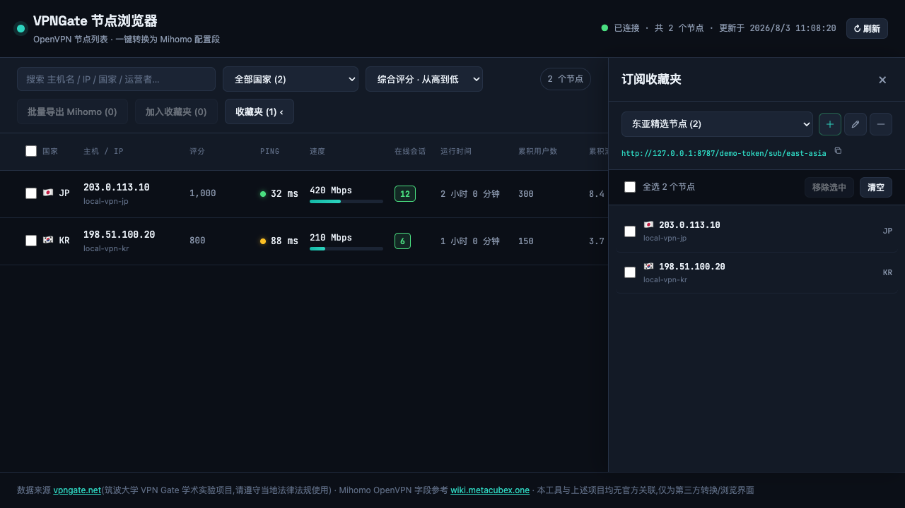
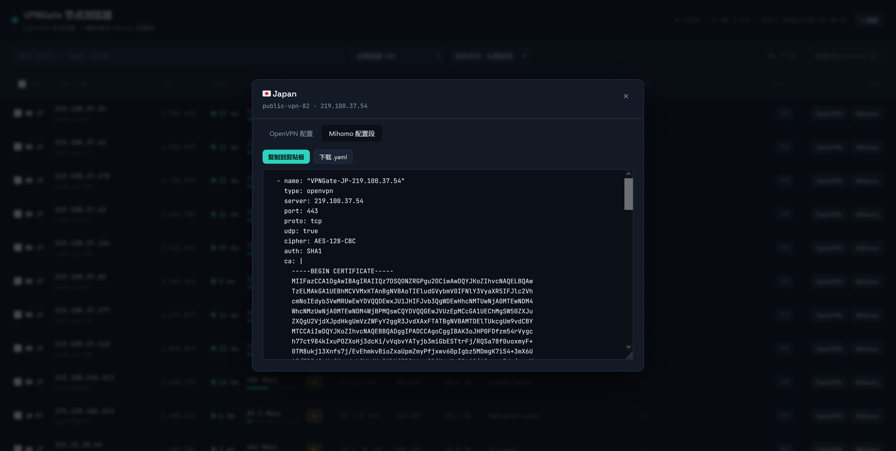

# VPNGate 节点浏览器 · OpenVPN → Mihomo

一个可以部署在 Cloudflare Workers 上的 VPNGate 节点浏览和转换工具。它会拉取 [VPNGate](https://www.vpngate.net) 公开的 OpenVPN 节点列表，并将 `.ovpn` 配置转换为 [Mihomo](https://wiki.metacubex.one/config/proxies/openvpn/) 的 `type: openvpn` 代理配置。

项目保留了单文件 Worker 的部署方式：只需部署 `worker.js` 即可使用节点浏览、单节点转换和批量导出。额外绑定 Cloudflare KV 后，还可以创建多个订阅收藏夹，让 Mihomo 通过独立的 `proxy-providers` 地址加载指定节点。

## 界面预览

### 节点列表与订阅收藏夹



### OpenVPN 转换为 Mihomo 配置



## 功能

### 节点浏览与转换

- 服务端拉取 `https://www.vpngate.net/api/iphone/` 的 CSV 数据，解析后通过 `GET /api/servers` 提供给页面。
- 节点列表支持搜索、国家筛选和按评分、Ping、速度、在线人数或运行时间排序。
- 可查看、复制和下载原始 `.ovpn` 文件。
- 自动解析 `remote`、`proto`、`cipher`、`auth`、`ca`、`cert`、`key`、`tls-crypt`、`comp-lzo` 等 OpenVPN 字段，生成 Mihomo `openvpn` 代理段。
- 可勾选多个节点，一次生成完整的 `proxies:` YAML。
- VPNGate 列表在 Cloudflare 边缘节点缓存 5 分钟；页面上的“刷新”可强制重新拉取。

### 订阅收藏夹

- 可创建多个收藏夹，每个收藏夹都有独立名称和订阅地址后缀。
- 支持单节点收藏，也支持勾选后批量加入。
- 页面右侧的可收缩抽屉可切换收藏夹、查看节点、全选、批量移除或一键清空。
- 收藏时会将节点的 OpenVPN 配置快照保存到 KV；即使节点暂时从 VPNGate 实时列表中消失，已有订阅也不会立即受影响。
- 每个收藏夹输出标准的 Mihomo proxy-provider YAML；空收藏夹输出 `proxies: []`。

### 访问保护

- 可选的 `ADMIN_TOKEN` Worker Secret 同时保护页面数据、收藏夹 API 和订阅地址。
- 设置后，打开页面需要先输入访问密码；密码只保存在当前标签页的 `sessionStorage` 中。
- 订阅地址会变为 `https://你的域名/ADMIN_TOKEN/sub/自定义后缀`。

## 部署

### 仅使用基础功能

如果只需要节点浏览、OpenVPN 转换和批量导出，可以直接部署 `worker.js`，无需 KV。收藏夹抽屉会提示尚未配置存储，其他功能仍可使用。

### Cloudflare 控制台（推荐）

1. 登录 [Cloudflare Dashboard](https://dash.cloudflare.com/)，进入 **Workers & Pages** 创建 Worker。
2. 打开在线编辑器，将本项目的 `worker.js` 完整粘贴进去并部署。
3. 如需订阅收藏夹，在 **Storage & Databases → KV** 手动创建一个 namespace。
4. 进入 Worker 的 **Settings → Bindings → Add → KV Namespace**，选择刚创建的 namespace，绑定变量名必须是 `SUBSCRIPTIONS`。
5. 在 **Settings → Variables and Secrets** 中添加 Secret `ADMIN_TOKEN`。公网部署强烈建议设置，可使用随机 UUID。
6. 访问 Cloudflare 分配的 `*.workers.dev` 域名，或在 Worker 设置中绑定自己的域名。

### Wrangler CLI

本项目不会自动选择已有的 Cloudflare 资源。先登录并手动创建 KV namespace：

```bash
npx wrangler login
npx wrangler kv namespace create vpngate-subscriptions
```

将返回的 namespace ID 填入 `wrangler.toml`：

```toml
[[kv_namespaces]]
binding = "SUBSCRIPTIONS"
id = "YOUR_KV_NAMESPACE_ID"
```

部署 Worker，再设置访问密码：

```bash
npx wrangler deploy
npx wrangler secret put ADMIN_TOKEN
```

`ADMIN_TOKEN` 是 Secret，不要把真实值写入 `wrangler.toml`，也不要将包含密码的 `.env` / `.dev.vars` 提交到 Git 仓库。

## 本地开发与测试

本地开发服务器需要 Node.js 20+，不需要安装 Wrangler，也不会访问 Cloudflare 账号：

```bash
node dev-server.mjs
```

启动后访问 <http://127.0.0.1:8787>。开发服务器会先运行 `node build.js`，并将本地收藏夹保存到 `.local-data/subscriptions-kv.json`。

无法访问 VPNGate 时，可用两个模拟节点测试完整交互：

```bash
VPNGATE_MOCK=1 node dev-server.mjs
```

如需同时测试登录和带密码的订阅路径：

```bash
VPNGATE_MOCK=1 ADMIN_TOKEN=your-local-token node dev-server.mjs
```

运行自动化测试：

```bash
node --test tests/worker.test.mjs
```

`page.html` 和 `worker-logic.js` 是源文件，`worker.js` 是构建产物。修改源文件后需要重新构建：

```bash
node build.js
```

## Mihomo proxy-provider 配置

在收藏夹抽屉中复制订阅地址，然后加入 Mihomo 主配置：

```yaml
proxy-providers:
  vpngate-favorites:
    type: http
    url: "https://你的域名/你的ADMIN_TOKEN/sub/japan-fast"
    path: ./proxy_providers/vpngate-favorites.yaml
    interval: 3600
    health-check:
      enable: true
      url: https://www.gstatic.com/generate_204
      interval: 600
```

注意：

- 未设置 `ADMIN_TOKEN` 时，订阅路径是 `https://你的域名/sub/japan-fast`。
- `path` 是 Mihomo 的本地缓存文件，相对路径位于 Mihomo `HomeDir` 内，不同 provider 应使用不同的 `path`。
- Mihomo 的 `size-limit` 单位是字节，不是节点数量。不需要限制时请省略该字段或设为 `0`；过小的值会截断 YAML，并可能导致 `file must have a proxies field` 错误。
- 订阅地址包含 `ADMIN_TOKEN`，应当像密码一样保管。

## 目录结构

```text
worker.js             Cloudflare Worker 入口（构建产物）
page.html             前端页面源码
worker-logic.js       Worker 路由、CSV 解析、收藏夹和订阅逻辑
build.js              将 page.html 和 worker-logic.js 合并为 worker.js
dev-server.mjs        不依赖 Wrangler 的本地开发服务器
tests/worker.test.mjs  Worker API 与订阅生命周期测试
wrangler.toml         Wrangler 部署配置
```

如果通过 Cloudflare 控制台部署，只需复制 `worker.js`；启用收藏夹时，仍需手动绑定 `SUBSCRIPTIONS` KV。

## 技术说明与已知限制

- **CSV 解析**：VPNGate 的 `Operator` 和 `Message` 是自由文本，可能包含逗号。解析时按“前 13 个固定字段 + 最后一个 Base64 配置字段 + 中间字段合并为 Message”的方式处理。
- **Mihomo 字段映射**：按 Mihomo OpenVPN 文档生成配置。非常见 `cipher`、`auth-user-pass`、`dev tap` 或 `tls-auth` 等情况会在页面中提示人工核对。
- **KV 一致性**：Cloudflare KV 是最终一致存储，修改收藏夹后，少数边缘位置可能需要短暂时间才能读到新值。
- **收藏夹容量**：单个收藏夹最多保存 500 个节点，实际可用容量还受 Cloudflare KV 单值大小限制影响。
- **缓存策略**：`/api/servers` 使用 Cloudflare Cache API 缓存 5 分钟；收藏夹 API 和订阅响应使用 `no-store`。
- **兼容模式**：未绑定 `SUBSCRIPTIONS` 时保留原有浏览和导出功能；未设置 `ADMIN_TOKEN` 时保留无密码的 `/sub/后缀` 路径。公网部署不建议使用无密码模式。

## 免责声明

- 节点数据来自 [VPNGate](https://www.vpngate.net)（日本筑波大学 VPN Gate 学术实验项目），请遵守所在地区的法律法规使用。
- 本工具是第三方浏览和格式转换界面，与 VPNGate、Mihomo 和 Clash Meta 项目均无官方关联。
